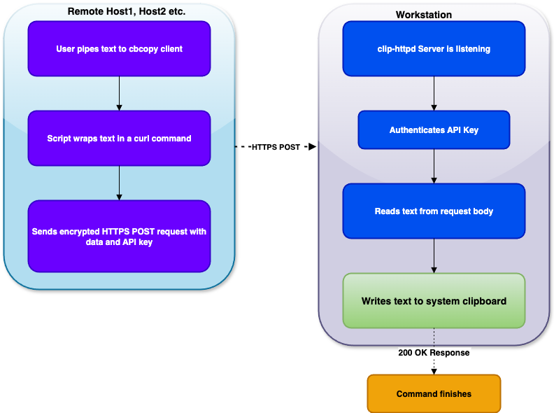

## Table Of Contents
  - [Introduction](#introduction)
  - [History](#history)
  - [Usage](#usage)
  - [Quick Start](#quick-start)
  - [Version](#version)
  - [How it works](#how-it-works)
    - [Server (Text Receiver)](#server-text-receiver)
    - [Client (Text Sender)](#client-text-sender)
  - [FLOW](#flow)
  - [Installation](#installation)
    - [Download](#download)
    - [Building from source](#building-from-source)
  - [How to Generate a Self-Signed Certificate](#how-to-generate-a-self-signed-certificate)
    - [Command flags of openssl](#command-flags-of-openssl)
    - [Dump the certificate](#dump-the-certificate)
  - [How to use](#how-to-use)
    - [Run the server on your desktop](#run-the-server-on-your-desktop)
    - [Run copy client from your remote hosts](#run-copy-client-from-your-remote-hosts)
  - [Examples](#examples)
  - [License is MIT](#license-is-mit)
  - [Authors](#authors)

## Introduction
[clip-httpd](https://github.com/muquit/clip-httpd) is a simple, secure, cross-platform clipboard server written in 
[Go](https://go.dev/). I use it to paste `text` to my Laptop/workstation's clipboard from remote
systems securely without pain of fumbling with mouse or firing up scp and such 
to get a file.

It listens on a TCP port for incoming HTTPS requests containing text 
data and copies that text to the system clipboard. Client authentication 
is required using a secret API key for secure communication with the server.
This allows you to securely update the system clipboard of your desktop 
from any other machine on your network using a simple HTTP request.

I hope you find this project useful! Pull requests, suggestions, and 
feedback are always welcome.

## History

My desktop is a Mac, but I use [iTerm2](https://iterm2.com/), [mosh](https://mosh.org/), [tmux](https://github.com/tmux/tmux/wiki) to connect to various 
remote machines and need to copy text from them, even from dumb terminals.
I had issues with clipboard functionality when mixing iTerm2, tmux, vim/nvim, etc.

It runs on my Mac and allows me to copy text or content of large text file 
to the Mac clipboard using 
[curl](https://curl.se/) over HTTPS from any remote environment. Especially for text files, it
is certainly much simpler than starting a scp session to copy a file. On macOS I 
just run `pbpaste > file.txt` to copy the content to a file.

It should work on Windows and
Linux as well, because it uses the go module [clipboard](https://github.com/atotto/clipboard) for copying text
to clipboard which supports Mac, Windows and Linux. I use [curl](https://curl.se/) as I have
[curl](https://curl.se/) available on the remote systems I use. It is possible to write a
portable client as well but I do not need it right now.

I'm sure there are similar tools with many features that exist, but my need
is simple. 

## Usage
```
clip-httpd v1.0.1 - A simple, secure, cross-platform clipboard server.
URL: https://github.com/muquit/clip-httpd/

Flags:
  -cert-file string
    	Path to TLS certificate file (enables HTTPS)
  -copy-command string
    	Custom command to copy data to clipboard
  -host string
    	Host address to bind the server to (default "0.0.0.0")
  -key-file string
    	Path to TLS key file (enables HTTPS)
  -port int
    	Port for the server to listen on (default 8881)
  -systray
    	Enable System Tray GUI
  -version
    	Print version and exit

** Specify server secret with env variable CLIP_HTTPD_APIKEY ***
```

## Quick Start

Get up and running in just a few steps:

1. **Generate a self-signed certificate (once per desktop where clip-httpd
   will be running):**
```bash
   openssl req -x509 -newkey rsa:4096 -keyout key.pem -out cert.pem -days 3650 -nodes
```

2. **Start the server on your desktop:**

```bash
 export CLIP_HTTPD_APIKEY='your_secret_key'
./clip-httpd -cert cert.pem -key key.pem
```

3. **Send text from a remote machine:**
```bash
 export CLIP_HTTPD_APIKEY='your_secret_key'
echo "Hello from remote!" | ./pbcopy.sh -h <your_desktop_ip> -p 8881
./pbcopy.sh -h <your_desktop_ip> -p 8881 < file.txt
```
4. **Desktop Integration**
```bash
./clip-httpd-systray -systray -cert cert.pem -key key.pem
```

Please look [Examples](#examples) section for varous usecases

## Version
The current version is 1.0.1

Please look at [ChangeLog](ChangeLog.md) for what has changed in the current version.


## How it works

The [clip-httpd](https://github.com/muquit/clip-httpd) works on a simple and secure **client-server model**.
The [clip-httpd](https://github.com/muquit/clip-httpd) binary is the server that runs on the machine whose 
clipboard you want to control, like your desktop. The client [pbcopy.sh](pbcopy.sh) is a small 
script runs on a remote machine that sends text to the server.

-----

### Server (Text Receiver)

The [clip-httpd](https://github.com/muquit/clip-httpd) server is a specialized web server that performs a few key tasks:

1.  **Listens for Connections:** It starts up and listens on a specific 
network port (e.g., `8881`) for incoming connections.

2.  **Secures the Connection:** When a client connects, the server uses 
the provided certificate files (`cert.pem`, `key.pem`) to establish a 
secure **HTTPS** tunnel. This encrypts all data sent between the client and server.

3.  **Authenticates the Client:** It inspects the incoming request for an `X-Api-Key` header.
It compares the key in the header to its own secret key. If they don't match, the connection is rejected.

4.  **Receives the Text:** If authentication is successful, the server reads the raw text data from the body of the `POST` request.

5.  **Updates the Clipboard:** This is the final and most important step. The server uses a native [Go](https://go.dev/) library 
called [clipboard](https://github.com/atotto/clipboard) to interact directly with the operating system's 
clipboard API with installed clipboard copy tools. But you can also use the flag
`-copy-commad` to supply a custom copy command.

-----

### Client (Text Sender)

The supplied [pbcopy.sh](pbcopy.sh) Bash script can be used at your remote machine as a client which uses [curl](https://curl.se/). Its job is to prepare and send the data.

1.  **Reads the Text:** It takes any text that is piped (`|`) or redirected (`<`) to it from its standard input.

2.  **Packages the Request:** It uses the [curl](https://curl.se/) command to wrap this text into an HTTPS `POST` request.

3.  **Adds the Secret Key:** It adds your secret key to the `X-Api-Key` header to authenticate itself.

4.  **Sends the Data:** It sends the complete, encrypted request over the network to the server's IP address and port.

-----

## FLOW



## Installation
### Download
* Download pre-compiled binaries from [Releases](https://github.com/muquit/clip-httpd/releases) page

* Please look at [How to use](#how-to-use)

### Building from source

Install [Go](https://go.dev/) first

* Compile native binary
```bash
git clone https://github.com/muquit/clip-httpd
cd clip-httpd
go build -ldflags "-s -w" .
or
make build
./clip-httpd -version
```
Cross-compile for other platforms
* Install [go-xbuild-go](https://github.com/muquit/go-xbuild-go)
Then, type:

```bash
go-xbuild-go
or 
make build_all
```
Look at `bin/ directory for archive with build binaries

Please look at [Makefile](Makefile) for more info


## How to Generate a Self-Signed Certificate
As [clip-httpd](https://github.com/muquit/clip-httpd) uses https, you must specify a certificate and private key before
starting the server.

You can create a self-signed SSL/TLS certificate for personal use with the 
[openssl](https://www.openssl.org/) command-line tool, which is pre-installed on macOS, Linux, and 
Windows Subsystem for Linux (WSL).

This command will generate a private key and a public certificate that is valid for 10 years.

1. Run the Command
Open your terminal and run the following command:

```bash
openssl req -x509 -newkey rsa:4096 -keyout key.pem -out cert.pem -days 3650 -nodes
```
2. Fill Out the Prompts
You'll be asked to provide information for the certificate, such as your 
country, state, and organization name. For a local, self-signed certificate,
ou can safely press Enter to accept the defaults for each prompt.

3. Check the Output
The command will create two files in your current directory:

* `key.pem`: Your private key. Keep this file secure and private.

* `cert.pem`: Your public certificate, which you can share.

### Command flags of openssl

| Flag               | Purpose                                                                                |
| ------------------ | -------------------------------------------------------------------------------------- |
| `req`              | The command for creating certificates and certificate requests.                        |
| `-x509`            | Creates a self-signed certificate instead of a certificate signing request (CSR).      |
| `-newkey rsa:4096` | Generates a new 4096-bit RSA private key.                                              |
| `-keyout key.pem`  | Specifies the filename for the new private key.                                        |
| `-out cert.pem`    | Specifies the filename for the new public certificate.                                 |
| `-days 3650`       | Sets the certificate's validity period to 10 years.                                    |
| `-nodes`           | (No DES) Creates the private key without encrypting it with a passphrase. This is crucial for servers that need to start automatically. |

### Dump the certificate
```bash
openssl x509 -text -noout -in cert.pem
```

## How to use

### Run the server on your desktop
* Generate self signed certificate first. 
* set the CLIP_HTTPD_APIKEY env variable, e.g.

```bash
export CLIP_HTTPD_APIKEY='your_secret'
```

* On your desktop machine, start the server

```bash
clip-httpd -cert cert.pem -key key.pem
```

### Run copy client from your remote hosts

Look at the sample client [pbcopy.sh](pbcopy.sh) script. It uses [curl](https://curl.se/). 
I use `pbcopy` command on mac, hence I named it [pbcopy.sh](pbcopy.sh). 

```bash
A remote clipboard copy client for clip-httpd.

This script reads from standard input and sends the data to a clip-httpd server.

Usage:
  pbcopy.sh [-h host] [-p port]

Options:
  -h    The hostname or IP address of the clip-httpd server (default: 192.168.1.72)
  -p    The port number of the clip-httpd server (default: 8881)

Required Environment Variable:
  CLIP_HTTPD_APIKEY   The secret API key for authentication.

Example:
  export CLIP_HTTPD_APIKEY="your-secret-key"
  echo "Hello from remote" | pbcopy.sh
  cat file.txt | pbcopy.sh -h 192.168.1.100 -p 9000
  pbcopy.sh < file.txt
```

## Examples

Instead of fumbling with mouse selection, starting scp to transfer a file, 
scrolling to find text boundaries, or dealing with terminal text that spans 
multiple screens, you can instantly pipe any command output directly to 
your clipboard. This is especially valuable during meetings, demos, or 
incident response when every second counts.

Also, I find this techniques very useful when working with LLMs.

```bash
# Copy an API key from a json file 
cat ~/api.key | jq -r .api_key | pbcopy.sh
```

```bash
# Copy to the clipboard of your laptop/workstation connected to a remote 
# system over VPN.
# First create a reverse ssh proxy from your system to the remote system
ssh -R 881:localhost:8881 user@remote_host

# At your remote host, copy text to localhost at port 8881
echo 'hello over VPN' | pbcopy.sh -h 127.0.0.1 -p 8881
```

```bash
# Copy an image to clipboard
cat file.png | base64 | pbcopy.sh

# Save the image from clipboard. on Mac, use pbpaste.
pbpaste | base64 -d > file.png

# On Linux
xclip -selection clipboard -o | base64 -d > file.png

# On Windows
# may require git bash, wsl for base64
powershell "Get-Clipboard | base64 -d > file.png"

# Any binary data can be copied and pasted this way
```

```bash
# On remote server - send a specific function to clipboard
sed -n '45,67p' main.go | pbcopy.sh
```

```bash
# Or send an entire file
cat config.yaml | pbcopy.sh
```

etc.

## License is MIT
MIT License - See [LICENSE](LICENSE) file for details.

## Authors
* Developed with [Google Gemini AI 2.5 Pro](https://gemini.google.com/app), working under my guidance and instructions.

* Documentation cleaned up by [Claude AI 4 Sonnet](https://claude.ai)


---
<sub>TOC is created by https://github.com/muquit/markdown-toc-go on Sep-15-2025</sub>
